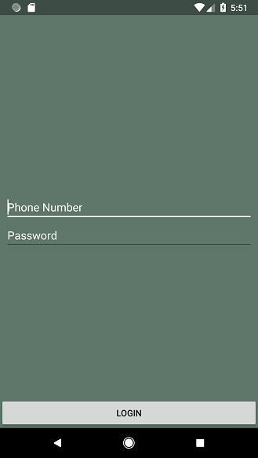
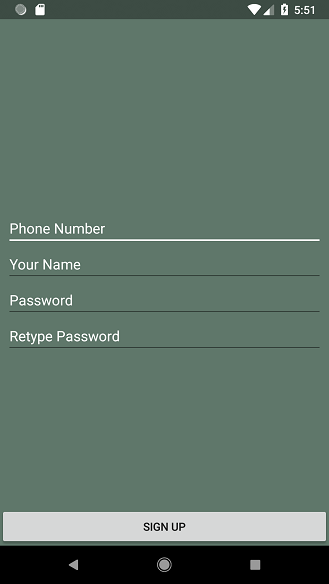
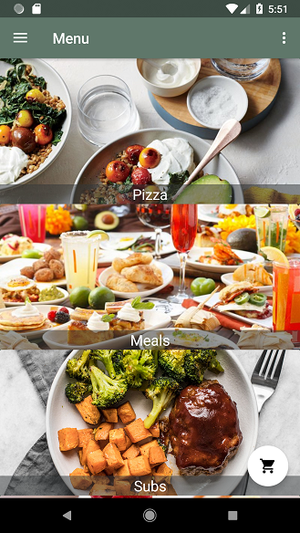
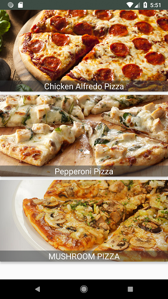

# OrdeRoid
Android app that lets users explore menus and food items with the ability to order and track your previous orders.

Designs by Amjed Muhsin

## Dependencies
1. Butterknife
2. Firebase
3. Picasso

## Setup
1. Clone the repo

2. Install dependencies
``` gradle's app module should already have them setup ```

3. Build & Start the project
``` import it in Android studio to run it on emulator ```

## Technologies
* **Backend**
  * Firebase with custom functions to verifiy users using their phone numbers
  * 3 databases are used. One to store registered users and others to store foods and categories.

### Screenshots






